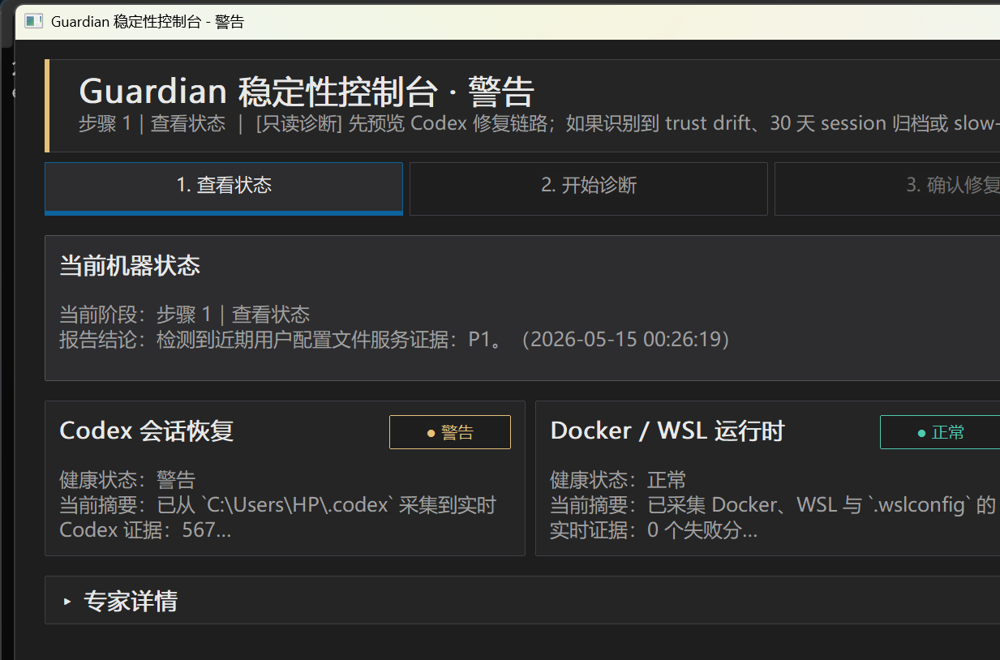
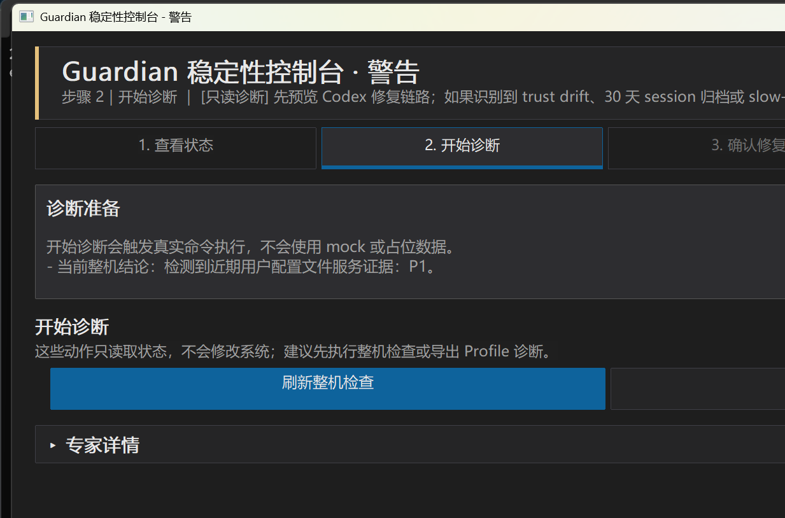
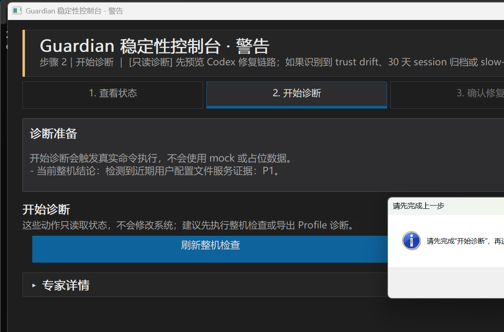

# Windows Codex 稳定性守护工具（Windows Codex Stability Guardian）

[](https://github.com/ZRainbow1275/windows-codex-stability-guardian/actions/workflows/ci.yml)
[](https://github.com/ZRainbow1275/windows-codex-stability-guardian/actions/workflows/release.yml)

面向 Windows 工作站的本地稳定性工具，覆盖 Codex CLI、Docker Desktop / WSL2、以及 Windows 用户配置文件三个常见故障域。

Guardian 的目标只有一个：把 Codex / Docker / Profile 这一类**反复出现、根因在本地状态漂移**的小故障，变成可观察、可证据化、可在 `--confirm` 守护下安全修复的事项；其它无法分类的情况一律只报告、绝不动手。

---

## 当前状态

| 项目 | 状态 |
| --- | --- |
| 发布线 | `v0.1.3` |
| 打包产物 | 已修复：Release zip 内的 `guardian.exe` 可直接双击启动桌面 GUI |
| 默认入口 | `guardian.exe` 无参数运行时进入桌面 GUI；CLI 子命令仍通过 `check` / `repair` / `diagnose` / `export` 显式调用 |
| 已验证产物 | `dist/v0.1.3/guardian.exe` 无参 GUI smoke 通过，`cargo test --workspace` 与 `cargo clippy --workspace --all-targets -- -D warnings` 通过 |
| 安全边界 | 只读诊断默认不写入；修复动作必须显式 `--confirm` |

从 `v0.1.3` 起，过去“打包后双击 `guardian.exe` 一闪而过、不显示 GUI”的问题已经通过正式 release 产物修复。原因是旧版本把无参启动当作 CLI 用法错误处理；现在无参入口会默认打开桌面 GUI，适合普通 Windows 用户从文件管理器直接启动。

## 桌面 GUI 运行截图

以下截图均来自真实打包产物通过无参数启动后的桌面 GUI。

### 只读健康概览



### 诊断步骤



### 受保护的操作顺序



---

## 社区支持

学 AI，上 L 站：[LinuxDO](https://linux.do/)

---

## 为什么做这个项目

OpenAI Codex CLI 在 Windows 上有一组反复被报告、长期未修复或修复不彻底的本地故障。受影响最严重的是 `/resume`、侧边栏历史、`codex resume` 三个入口。这些症状共同特征是：**会话文件其实还在磁盘上，但 Codex 因本地数据库 / 配置 / 启动器漂移而读不出来**。

Guardian 直接对位以下上游 issues：

| 上游 Issue | 现象（Windows） | Guardian 分类 | 修复策略 |
| --- | --- | --- | --- |
| [openai/codex#14469](https://github.com/openai/codex/issues/14469) | Severe chat-switch lag；线程切换 / `/resume` 卡顿（issue 已 closed，但 slow-path 症状仍可在 0.x 版本上复现） | **C4** | TUI 日志检测到 `Loading sessions...`，在 `--confirm` 下安装 resume picker helper；启动器只截获 picker-only `codex resume`，其他命令继续使用已安装的 upstream CLI |
| [openai/codex#17540](https://github.com/openai/codex/issues/17540) | Windows 桌面应用重启后侧边栏历史会话丢失，但磁盘上 sessions 还在（open） | **C2** | 备份 `state_*.sqlite` → 清除最新 state DB 中的 stale rows（`threads.has_user_event` 漂移），让 Codex 重新认得磁盘上的会话 |
| [openai/codex#15007](https://github.com/openai/codex/issues/15007) | `/resume` 或 `codex resume` 不加载 project config（open） | **C6 + C2** | 备份 `%USERPROFILE%\.codex\config.toml` → 补回缺失的 trusted project 条目；同时清理 stale rows 让会话重新可见 |
| [openai/codex#14756](https://github.com/openai/codex/issues/14756) | Codex CLI 即使是简单请求也响应极慢（open） | **C4（+C2）** | 与 #14469 同一条 slow-path 路径：状态库 stale rows + TUI `Loading sessions` 联合判定，按需安装 resume picker wrapper，但不替换 Codex CLI 二进制 |
| [openai/codex#14949](https://github.com/openai/codex/issues/14949) | Windows shell 任务被中断后留下孤儿子进程；重启 Codex 时可能进入 process storm（open） | **诊断 + 证据导出**（不自动 kill） | `guardian diagnose profile` + `guardian export bundle` 收集证据；不自动终止进程，避免误杀安全软件或 vmmem |

> 注：Guardian 不"代替"上游修复，也不长驻后台修改你的环境。它只在你显式给出 `--confirm` 时执行已分类的修复路径，其余情况下只做只读观察、写出结构化健康报告与审计文件。

---

## 工作原则

- **先观察再修复** — 每一次修复都从 live 机器证据出发，绝不基于假设
- **先备份再写入** — SQLite、`config.toml`、Codex 启动器在变更前一律备份
- **先确认再变更** — 必须显式 `--confirm`，没有后台自动修复
- **修复面有界** — Guardian 只修它能从证据分类的故障类型；其余只报告、不触碰
- **Windows 原生、低开销** — 工作站本地运行，使用 Windows 事件日志、注册表读取、必要时调 PowerShell
- **零远端依赖** — 不上报遥测、不调用云、不需要账号

---

## 故障分类表（C / D / P）

Guardian 用证据驱动的失败分类系统，将本地故障落到具体的"故障类（FailureClass）"上。

### Codex 域

| 分类 | 含义 | 触发证据 |
| --- | --- | --- |
| `C2` | Codex 状态数据库漂移（**stale rows**） | 最新 `state_*.sqlite` 中 `threads.has_user_event` 出现陈旧记录 |
| `C3` | Codex 版本处于已知风险窗口 | `codex --version` 落在已知会触发 picker bug 的版本范围 |
| `C4` | `/resume` slow-path 漂移 | `~/.codex/log/codex-tui.log` 近期含 `Loading sessions...` |
| `C5` | 配置访问错误 | TUI 日志含 config / access error；或 `config.toml` 解析失败 |
| `C6` | trusted-project 漂移 | `%USERPROFILE%\.codex\config.toml` 缺少当前项目的 trust 条目 |

### Docker / WSL 域 与 Profile 域

`D1`–`D4` 覆盖 `.wslconfig` 基线漂移、Docker / WSL 运行时状态；`P1`–`P4` 覆盖 Windows 用户配置文件相关事件（Temp Profile、ProfileList 注册表锁、安全软件介入等）。Profile 域**全程只读**，不会修改 ProfileList。

---

## Guardian 能做什么

### Codex 健康检查与修复

- 读取 `~/.codex` 下的 `history.jsonl`、rollout / session 文件、最新 `state_*.sqlite`
- 分类 `C2`（stale rows）/ `C4`（slow-path）/ `C6`（trust 漂移）等
- 在 `--confirm` 下：
  - 备份 SQLite → 清理 stale rows → post-write 校验
  - 备份 `config.toml` → 追加 trusted project 条目
  - 备份原启动器 → 安装 no-downgrade resume picker wrapper；非 picker 命令继续走 upstream `@openai/codex`
- 即使 slow-path（`C4`）那一步因为启动器或 helper 写入失败，也**不会回滚**前面已经成功的 stale-row / trust 修复；失败原因写入审计

### Docker / WSL 基线恢复

- 校验 `.wslconfig` 基线键
- 区分"配置漂移"和"运行时恢复"
- 若有运行中的容器，会主动**阻止**高风险的 runtime 重启
- `--confirm` 模式下写出审计

### Profile 诊断（只读）

- 读 User Profile Service 事件
- 分类 Temp Profile / ProfileList 注册表锁信号
- 检测安全软件介入迹象
- 输出结构化诊断 JSON
- **永远不会**自动改 ProfileList，也不会终止安全软件进程

### Bundle 导出

- 把当前健康报告、profile 诊断、审计摘要打包成支持 bundle，便于事后排查或团队协助

---

## 命令一览

| 命令 | 用途 | 写入边界 |
| --- | --- | --- |
| `guardian.exe check` | 跑只读健康检查 | 只读 |
| `guardian.exe repair codex` | 检查 + 可选修复 Codex 漂移 | 写入需 `--confirm` |
| `guardian.exe repair docker` | 检查 + 可选修复 Docker / WSL 漂移 | 写入需 `--confirm` |
| `guardian.exe diagnose profile` | 输出 profile 诊断 + 引导式恢复建议 | 只读 |
| `guardian.exe export bundle` | 导出当前健康 + 审计支持 bundle | 只读（对被监控系统） |
| `guardian.exe` | 默认启动桌面 GUI，适合文件管理器双击 | 无显式动作不修复 |
| `guardian.exe gui` | 启动桌面 GUI | 无显式动作不修复 |
| `guardian.exe tray` | 启动系统托盘入口 | 无显式动作不修复 |

> **注意**：从 `v0.1.3` 之后，文件管理器里直接双击 `guardian.exe` 会打开桌面 GUI；命令行用户仍可显式运行 `guardian.exe check`、`guardian.exe repair ...` 等子命令。想要常驻后台 UI，请用 `guardian.exe tray`。

---

## 快速开始

### 1. 下载 Release

从 [Releases](https://github.com/ZRainbow1275/windows-codex-stability-guardian/releases) 获取：

- `guardian-v<version>-windows-x64.zip` ← **唯一推荐下载**：含 `guardian.exe` + README/CHANGELOG/LICENSE + `tools/repair-codex-resume.ps1`
- `SHA256SUMS.txt` ← 校验推荐 zip 的 SHA-256

> GitHub Release 页面会固定显示 `Source code (zip)` 和 `Source code (tar.gz)`。这两个是 GitHub 按 tag 自动生成的源码归档，不是 Windows 可执行程序包；普通用户请不要下载它们。

### 2. 校验下载

推荐流程：

1. 在 GitHub 上确认 tag 是 signed / verified
2. 下载 zip 与 `SHA256SUMS.txt`
3. 本地校验 hash：

```powershell
Get-FileHash .\guardian-v<version>-windows-x64.zip -Algorithm SHA256
```

把输出和 `SHA256SUMS.txt` 对照。

### 3. 先跑只读体检

```powershell
guardian.exe --json check
```

这一步**纯只读**，不会动你机器上任何东西。看它在 `domains.codex.evidence` 里报告的 `failure_classes` 是 `C2 / C4 / C6` 中的哪些。

### 4. 按需升级到修复

```powershell
# Codex：先 dry-run 看会做什么
guardian.exe --json repair codex --dry-run

# 真正执行（备份后修复 stale rows / trust / slow-path）
guardian.exe --json repair codex --confirm

# Docker / WSL 基线
guardian.exe --json repair docker --dry-run

# Profile 只读诊断
guardian.exe --json diagnose profile --output profile-diagnosis.json

# 打 support bundle
guardian.exe --json export bundle

# 常驻托盘 UI
guardian.exe tray
```

---

## 上游 Issue 与操作 cheat sheet

> 想直接对症操作，按下面的步骤走。

### 症状对应 #14469 / #14756（slow-path、`/resume` 卡顿）

```powershell
# 1. 体检：看 codex 域的 failure_classes 是否包含 C4
guardian.exe --json check

# 2. 在 dry-run 下确认 Guardian 打算做什么
guardian.exe --json repair codex --dry-run

# 3. 执行确认修复；该路径不会替换 Codex CLI 二进制：
guardian.exe --json repair codex --confirm
```

`C4` 修复链：备份 Codex 启动器（launcher） → 安装 `codex-resume-picker.js` helper + no-downgrade wrapper → post-write 校验。Wrapper 只截获 picker-only `codex resume` 列表入口；`codex --version`、`codex features list`、`codex resume --last`、显式 session-id resume 等命令继续委托给 upstream `@openai/codex`。

### 症状对应 #17540（重启后侧边栏历史丢失）

```powershell
guardian.exe --json check                       # 应看到 C2，evidence.stale_rows > 0
guardian.exe --json repair codex --dry-run
guardian.exe --json repair codex --confirm      # 备份 sqlite → 清 stale rows → 校验
```

修完之后重启 Codex 桌面应用，侧边栏历史应该重新出现。

### 症状对应 #15007（`/resume` 不加载 project config）

```powershell
# 在出问题的项目根目录里跑（让 Guardian 知道目标 project path）
cd D:\path\to\your\project
guardian.exe --json check                                       # 应看到 C6
guardian.exe --json repair codex --dry-run
guardian.exe --json repair codex --confirm
```

修复链：备份 `%USERPROFILE%\.codex\config.toml` → 追加当前 project 的 trusted project 条目 → 重新解析校验。

### 症状对应 #14949（孤儿子进程 / process storm）

Guardian **不会自动 kill 进程**，因为误杀 `vmmem` 或安全软件代价过大。它的角色是**证据收集**：

```powershell
# 1. 立即抓 profile + Codex 域证据（只读）
guardian.exe --json diagnose profile --output profile-diagnosis.json
guardian.exe --json export bundle

# 2. 把 bundle（默认在 %LOCALAPPDATA%\guardian\bundles 下）和 profile-diagnosis.json
#    一并附在 issue / 求助贴里
```

之后再决定是手动 `taskkill /T` 进程树、重启 Codex，还是按 issue #14949 里讨论的 workaround 处理。

---

## 安全模型

Guardian 故意做得很保守：

- `guardian.exe check` 永远只读
- 写入操作必须经过 `--confirm`
- Codex 修复**先备份**当前 state SQLite
- Codex slow-path（`C4`）启动器 wrapper **只在** `guardian repair codex --confirm` 内执行，且必须保持 non-picker 命令委托给已安装的 upstream Codex CLI
- Profile 诊断**永不**自动编辑 `ProfileList`，**永不**终止安全软件
- Docker / WSL 的运行时重启会先看 live 机器状态再决定是否拒绝

---

## 数据路径

默认位置：

- 审计：`%LOCALAPPDATA%\guardian\audits`
- 支持 bundle：`%LOCALAPPDATA%\guardian\bundles`
- 备份（SQLite / config.toml / launcher）：`%LOCALAPPDATA%\guardian\backups`

---

## 仓库结构

| 路径 | 用途 |
| --- | --- |
| `apps/guardian/` | 主程序入口、CLI、托盘、GUI、打包脚本 |
| `crates/guardian-core/` | 共享类型、策略、审计结构 |
| `crates/guardian-observers/` | 只读机器证据采集与分类器 |
| `crates/guardian-repair/` | 修复编排、bundle 导出、守护写入路径 |
| `crates/guardian-windows/` | Windows 专用辅助：路径、事件日志、进程执行、注册表 |
| `.github/workflows/` | CI、tag 驱动发布、版本号驱动自动发布流水线 |

---

## 开发

### 环境

- Windows
- Rust stable
- PowerShell

### 本地构建

```powershell
cargo build -p guardian
cargo test --workspace
```

### 本地打 release 包

```powershell
.\apps\guardian\scripts\package-release.ps1 -Version v0.1.1
```

产物落到 `dist\<version>\`。Release zip 只包含 `guardian.exe`、项目文档和 Guardian-owned tools（`codex-resume-picker.js`、`repair-codex-resume.ps1`）。它不会发布 `codex.exe` 或 `vendor-hotfix` 二进制；Codex CLI 版本必须来自用户当前安装的 upstream `@openai/codex`。

### 自动发布

`auto-release` workflow 会在 `main` 分支版本号更新后读取 workspace package version，若对应的 `vX.Y.Z` tag 尚不存在，则自动打包、创建 tag、发布 GitHub Release。Release 自定义资产只上传：

- `guardian-vX.Y.Z-windows-x64.zip`
- `SHA256SUMS.txt`

GitHub 自动显示的 `Source code (zip)` / `Source code (tar.gz)` 是 tag 源码快照，不是 Windows 用户包。

---

## 项目状态

当前发布线：**v0.1.4**

已实现并接通：

- Codex 健康检查（history、sessions、state SQLite、TUI 日志、trusted-project 配置）
- Codex 托管修复编排：`C2`（stale rows）/ `C6`（trust 漂移）/ `C4`（slow-path）三链联合执行
- 修复链 fail-soft：`C4` 步骤失败不会丢弃前面已成功的 `C2 / C6` 修复，失败原因落到审计
- Docker / WSL 检查与守护下的 `.wslconfig` / runtime 修复
- Profile 诊断与引导式恢复
- Bundle 导出（含保留策略）
- Tray 与 GUI 入口，复用 CLI 同一条修复管线

---

## 安全与隐私

本仓库刻意不包含机器特定的密钥、私有 session 文件或仅本地的笔记。

参见 [SECURITY.md](./SECURITY.md)。

---

## License

MIT
